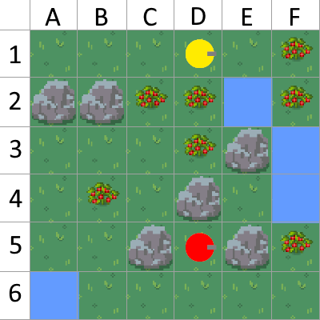

# Feast & Forage - Research Environment for Automated Game Balancing


This is the repository for the environment _Feast \& Forage_ for asymmetric game balancing research
which has been used in case studies for several of my publications (see below).

The code along the models for balancing of asymmetric player archetypes have been published
in the following paper:

```
@inproceedings{rupp_level_the_level_2025,
author = {Rupp, Florian and Eckert, Kai},
title = {Level the Level: Balancing Game Levels for Asymmetric Player Archetypes With Reinforcement Learning},
year = {2025},
doi = {10.1145/3723498.3723747},
booktitle = {Proceedings of the 20th International Conference on the Foundations of Digital Games},
articleno = {48},
numpages = {4},
series = {FDG '25}
}
```


# Overview


<div style="text-align:center;">
<p align="center">
    
</p>
</div>

Feast & Forage has been derived from the Neural MMO environment (Suarez et al.) in order to
focus on a competitive tile-based two player forage and survival setting.

## Game

* The game is played on a 6x6 tile-based map where two players compete for food and water resources.
* Victory is achieved by either collecting five food resources or  by surviving the opponent.
* There are four tile types: grass, rock, water, and food. Rock and water tiles impede movement.
* Players make moves simultaneously, choosing from four directions: up, down, left, or right.
* Their states include position, health, water, and food levels. 
* Each turn, players lose water and food, with health depleting if both reach zero.
* When a player’s health indicator reaches zero, the player has lost.
* Players can replenish food by consuming food tiles, which then become scrub tiles.
* There’s a 2.5% chance for scrub tiles to respawn as food. 
* Water can be replenished by moving onto adjacent water tiles, which are never depleted.
* Health is restored gradually if food and water levels exceed 50%.

## Challenges for asymmetric game balancing

* Asymmetric distribution of the resources spatially:
  * Where must resources placed in relation to players' start position?
  * Where can blocking tiles placed in order to prevent the access for players?
* Asymmetric player archetypes:
  * How can the game still be balanced entirely through the level when the players are different? E.g., one player can cross rock tiles while the other cannot?
  * Can this still be done when the players have different stats or win conditions?


## Structure

* The code for the game environment can be found in ``/feast_and_forage``. A short demo is given in the ```demo.ipynb``` notebook.
* Different heuristic player archetypes can be found in ``archetypes``.
* Trained models for different archetype setups can be found in ``/models``. For code to run and train models please see the repository of my previous research [here](https://github.com/FlorianRupp/pcgrl-simulation-driven-balancing).


## Creating a custom archetype/heuristic

* Derive a class from ```feast_and_forage.agent.Agent```.
* Overwrite the ``__call__`` method.

```
class MyArchetype(Agent):
    def __init__(self):
        super().__init__()

    def __call__(self, level, x, y):
        # level is the current level. (x,y) is the agent's position.
        # do stuff here...
```


## Publications

If you use this code, please consider these publications and citing if relevant to your context:

* Generation and balancing of asymmetric levels simulation-driven with reinforcement learning:
```
Journal Paper:
@article{rupp_simulation_2024,
  author={Rupp, Florian and Eberhardinger, Manuel and Eckert, Kai},
  journal={IEEE Transactions on Games}, 
  title={Simulation-Driven Balancing of Competitive Game Levels with Reinforcement Learning}, 
  year={2024},
  volume={},
  number={},
  pages={1-11},
  doi={10.1109/TG.2024.3399536}}

Conference Paper:
@inproceedings{rupp_balancing_2023,
  author={Rupp, Florian and Eberhardinger, Manuel and Eckert, Kai},
  booktitle={2023 IEEE Conference on Games (CoG)}, 
  title={Balancing of competitive two-player Game Levels with Reinforcement Learning}, 
  year={2023},
  pages={1-8},
  doi={10.1109/CoG57401.2023.10333248}}
```
* User study: Empirical evaluation with human play testers of balanced levels:
```
@inproceedings{rupp_balanced_2024,
  author={Rupp, Florian and Puddu, Alessandro and Becker-Asano, Christian and Eckert, Kai},
  booktitle={2024 IEEE Conference on Games (CoG)}, 
  title={It might be balanced, but is it actually good? An Empirical Evaluation of Game Level Balancing}, 
  year={2024},
  pages={1-4},
  keywords={Surveys;Procedural generation;Statistical analysis;Games;Reinforcement learning;Manuals;Optimization;game balancing;playtesting;survey;human evaluation},
  doi={10.1109/CoG60054.2024.10645642}}
```

* Balancing for asymmetric player archetypes with reinforcement learning:
```
Coming soon
```


* The [NMMO Environment](https://github.com/NeuralMMO/environment) (Suarez et al.):
```
@misc{suarez_neural_2019,
	title = {Neural {MMO}: {A} {Massively} {Multiagent} {Game} {Environment} for {Training} and {Evaluating} {Intelligent} {Agents}},
	author = {Suarez, Joseph and Du, Yilun and Isola, Phillip and Mordatch, Igor},
	year = {2019},
	note = {arXiv:1903.00784}
}
```
